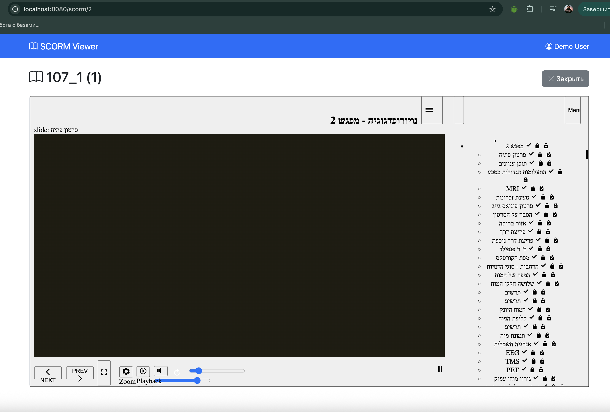

# SCORM Viewer

Система для загрузки и просмотра SCORM пакетов с базовой статистикой.

## Требования

- Docker и Docker Compose
- 2GB свободной памяти
- Порт 8080 должен быть свободен

## Установка

1. Клонируйте репозиторий:
```bash
git clone https://github.com/KhalesArtem/testZipArhive.git
cd testZipArhive
```

2. Запустите Docker контейнеры:
```bash
docker compose up -d --build
```

3. Установите зависимости Laravel (если еще не установлены):
```bash
docker exec scorm-app composer install
```

4. Скопируйте .env файл:
```bash
cp .env.example .env
```

5. Сгенерируйте ключ приложения:
```bash
docker exec scorm-app php artisan key:generate
```

6. Выполните миграции:
```bash
docker exec scorm-app php artisan migrate
```

7. (Опционально) Загрузите тестовые данные:
```bash
docker exec scorm-app php artisan db:seed
```

8. Создайте символическую ссылку для storage:
```bash
docker exec scorm-app php artisan storage:link
```

9. **ВАЖНО!** Запустите воркер очереди для обработки загруженных файлов:
```bash
docker compose exec -d app php artisan queue:work --daemon --tries=3 --timeout=600
```

## Использование

1. Откройте браузер и перейдите на http://localhost:8080
2. Нажмите "Загрузить SCORM пакет"
3. Выберите ZIP файл с SCORM контентом
4. После загрузки нажмите "Открыть" для просмотра

## Функционал

✅ Загрузка SCORM пакетов (ZIP файлы до 100MB)  
✅ Валидация SCORM (проверка наличия imsmanifest.xml)  
✅ Просмотр SCORM контента в iframe  
✅ Статистика просмотров для каждого пакета  
✅ Удаление пакетов  

## Структура БД

- `scorm_packages` - информация о загруженных пакетах
- `scorm_user_stats` - статистика просмотров

## Команды Docker

```bash
# Запуск контейнеров
docker compose up -d

# Остановка контейнеров
docker compose down

# Просмотр логов
docker compose logs -f app

# Вход в контейнер
docker exec -it scorm-app bash

# Выполнение Artisan команд
docker exec scorm-app php artisan [command]

# Запуск воркера очереди в фоне (обязательно для обработки файлов!)
docker compose exec -d app php artisan queue:work --daemon --tries=3 --timeout=600

# Запуск воркера с выводом в консоль (чтобы видеть процесс обработки)
docker compose exec app php artisan queue:work --tries=3 --timeout=600

# Проверка, работает ли воркер
docker compose exec app ps aux | grep -E "artisan queue|PID"

# Остановка воркера
docker compose exec app php artisan queue:restart
```

## Проверка кода с PHPStan

```bash
# Запуск проверки
docker exec scorm-app composer phpstan

# Очистка кеша PHPStan
docker exec scorm-app composer phpstan-clear
```

[Документация PHPStan](https://phpstan.org/user-guide/getting-started)

## Доступ к базе данных

Для подключения к MySQL используйте:
- **Host:** localhost
- **Port:** 3307
- **Database:** scorm_db
- **Username:** scorm_user
- **Password:** password

## Известные ограничения

- Максимальный размер файла: 100MB
- Поддерживаются только SCORM 1.2 и SCORM 2004
- User ID зафиксирован как 1 (без системы авторизации)

## Тестирование

Для тестирования можно использовать бесплатные SCORM пакеты с:
- https://scorm.com/scorm-explained/technical-scorm/golf-examples/

## Структура проекта

```
├── app/
│   ├── Http/Controllers/ScormController.php
│   ├── Models/
│   │   ├── ScormPackage.php
│   │   └── ScormUserStat.php
│   └── Services/ScormService.php
├── database/
│   ├── migrations/
│   └── seeders/DatabaseSeeder.php
├── resources/views/
│   ├── layouts/app.blade.php
│   └── scorm/
│       ├── index.blade.php
│       ├── upload.blade.php
│       └── viewer.blade.php
├── routes/web.php
├── docker-compose.yml
├── Dockerfile
├── phpstan.neon
└── README.md
```

## Пример интерфейса

![SCORM Viewer Interface])